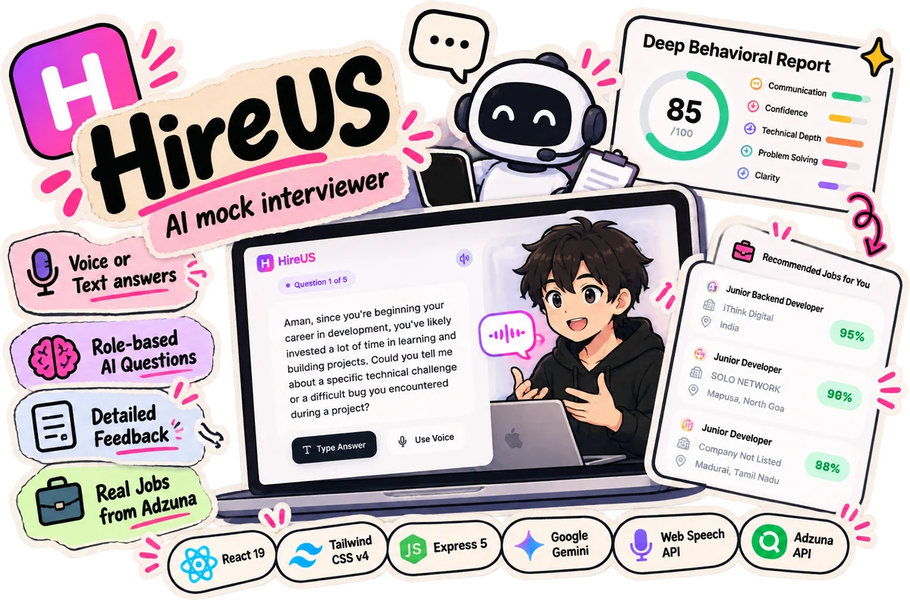

# HireUS

**An AI mock interviewer.** HireUS interviews you for the role you want at the level you're at, listens to spoken or typed answers, hands back a scored report, and then finds real job openings that fit.



Built by **Aman Dixit** as a minor project at MITS Gwalior.

## What it does

- **Tailored interviews.** Questions adapt to the candidate's target role, industry, experience level and interview type, so a fresher and a senior get very different interviews. Five questions per session.
- **Voice or keyboard.** The browser's speech recognition transcribes spoken answers, speech synthesis reads each question aloud, and speaking pace is tracked in words per minute.
- **A scored report.** Gemini grades the interview on four metrics (confidence, clarity, knowledge and fluency) and returns strengths, weaknesses and an ideal answer for every question.
- **Real openings.** The results page pulls live listings from the Adzuna jobs API and ranks the top five by fit.

## Stack

| Part | Tech |
|---|---|
| Client | React 19, Vite, Tailwind CSS v4, React Router, Web Speech API |
| Server | Node.js, Express 5, Google Gemini (`gemini-2.5-flash`), Adzuna API |

## Run it locally

You need Node.js 18+, a [Gemini API key](https://aistudio.google.com/app/apikey) and [Adzuna API credentials](https://developer.adzuna.com/).

```bash
# 1. API server (port 5001)
cd server
npm install
cp .env.example .env   # then fill in your keys
npm start

# 2. Client, in a second terminal
cd client
npm install
npm run dev
```

Open the URL Vite prints (usually http://localhost:5173). Speech input works best in Chrome.

Without a Gemini key the server still runs and falls back to a fixed opening question, so the interface can be explored offline.

## API

| Method | Route | Purpose |
|---|---|---|
| `POST` | `/start-interview` | First question, built from the candidate profile |
| `POST` | `/next-question` | Next question, informed by the answers so far |
| `POST` | `/analyze-interview` | Scores and feedback for the whole interview |
| `GET` | `/job-recommendations` | Live openings for `targetRole`, ranked by fit |
